# 🔍 Informe de Diagnóstico Integral 360° — CB.app
**Fecha de Auditoría:** Auto-generado por AI Software Factory
**Puntuación de Salud de Código:** 85/100 (Excelente)

---

## 📊 1. Métricas del Repositorio
- **Total de Archivos:** 1942
- **Líneas de Código Estimadas:** 104,750
- **Rutas / Endpoints Detectados:** 367
- **Modelos de Base de Datos:** 62

### Distribución de Lenguajes:
- **PHP:** 518 archivos
- **SQL:** 9 archivos
- **Python:** 13 archivos
- **JavaScript:** 17 archivos
- **Java:** 1 archivos
- **Kotlin:** 1 archivos
- **Swift:** 2 archivos
- **Dart/Flutter:** 43 archivos
- **HTML:** 2 archivos
- **CSS:** 3 archivos

---

## 🗺️ 2. Catálogo de Rutas y APIs (367 endpoints)
| Método | URI / Endpoint | Controlador / Handler | Archivo Origen |
|---|---|---|---|
| `POST` | `api/login` | `AuthApiController, 'login'` | api.php |
| `POST` | `api/register` | `AuthApiController, 'register'` | api.php |
| `POST` | `api/google` | `AuthApiController, 'loginGoogle'` | api.php |
| `POST` | `api/password/email` | `\App\Http\Controllers\Auth\PasswordResetController, 'email'` | api.php |
| `POST` | `api/logout` | `AuthApiController, 'logout'` | api.php |
| `GET` | `api/me` | `AuthApiController, 'me'` | api.php |
| `GET` | `api/badges` | `AuthApiController, 'getBadges'` | api.php |
| `POST` | `api/cambiar-contrasena` | `AuthApiController, 'cambiarContrasena'` | api.php |
| `POST` | `api/profile` | `AuthApiController, 'updateProfile'` | api.php |
| `POST` | `api/adultos/verificar` | `AuthApiController, 'verificarCredencialesAdultos'` | api.php |
| `POST` | `api/delete_account` | `AuthApiController, 'deleteAccount'` | api.php |
| `GET` | `api/items` | `ItemApiController, 'index'` | api.php |
| `GET` | `api/items/buscar` | `ItemApiController, 'buscar'` | api.php |
| `GET` | `api/items/{id}` | `ItemApiController, 'show'` | api.php |
| `GET` | `api/categorias` | `ItemApiController, 'categorias'` | api.php |
| `GET` | `api/colors` | `ItemApiController, 'colors'` | api.php |
| `POST` | `api/images` | `\App\Http\Controllers\ImageController, 'store'` | api.php |
| `GET` | `api/ubicacion/provincias` | `DireccionApiController, 'provincias'` | api.php |
| `GET` | `api/ubicacion/municipios/{id_provincia}` | `DireccionApiController, 'municipios'` | api.php |
| `GET` | `api/empleos` | `function (` | api.php |
| `GET` | `api/ayuda/{slug}` | `function ($slug` | api.php |
| `GET` | `api/delivery/calcular` | `\App\API\DeliveryZonaController, 'calcular'` | api.php |
| `GET` | `api/` | `CarritoApiController, 'index'` | api.php |
| `POST` | `api/agregar` | `CarritoApiController, 'agregar'` | api.php |
| `DELETE` | `api/vaciar` | `CarritoApiController, 'vaciar'` | api.php |
| `DELETE` | `api/{id_item}` | `CarritoApiController, 'eliminar'` | api.php |
| `PUT` | `api/{itemIntencionId}/cantidad` | `CarritoApiController, 'actualizarCantidad'` | api.php |
| `PUT` | `api/{itemIntencionId}/seleccion` | `CarritoApiController, 'marcarSeleccionado'` | api.php |
| `GET` | `api/getnegociaciones/{itemId}` | `\App\Http\Controllers\NegociacionController, 'getNegociaciones'` | api.php |
| `POST` | `api/savenegociaciones` | `\App\Http\Controllers\NegociacionController, 'store'` | api.php |
| `GET` | `api/items-usuario` | `\App\Http\Controllers\ItemController, 'getItemsUsuario'` | api.php |
| `POST` | `api/crearPaquete` | `\App\Http\Controllers\PaqueteController, 'crearPaquete'` | api.php |
| `PUT` | `api/editarPaquete/{id}` | `\App\Http\Controllers\PaqueteController, 'editarPaquete'` | api.php |
| `GET` | `api/mis-items` | `ItemApiController, 'userItems'` | api.php |
| `GET` | `api/mis-items/{id}` | `ItemApiController, 'userItemDetail'` | api.php |
| `POST` | `api/items/{id}/update` | `ItemApiController, 'update'` | api.php |
| `POST` | `api/items` | `ItemApiController, 'store'` | api.php |
| `DELETE` | `api/items/{id}` | `ItemApiController, 'destroy'` | api.php |
| `GET` | `api/` | `NegociacionApiController, 'index'` | api.php |
| `POST` | `api/` | `NegociacionApiController, 'store'` | api.php |
| `GET` | `api/{id}` | `NegociacionApiController, 'show'` | api.php |
| `POST` | `api/{id}/aceptar` | `NegociacionApiController, 'aceptar'` | api.php |
| `POST` | `api/{id}/rechazar` | `NegociacionApiController, 'rechazar'` | api.php |
| `POST` | `api/{id}/contraoferta` | `NegociacionApiController, 'contraoferta'` | api.php |
| `POST` | `api/{id}/cancelar` | `NegociacionApiController, 'cancelar'` | api.php |
| `POST` | `api/{id}/confirmar-emisor` | `NegociacionApiController, 'confirmarEmisor'` | api.php |
| `POST` | `api/{id}/confirmar-receptor` | `NegociacionApiController, 'confirmarReceptor'` | api.php |
| `POST` | `api/{id}/aceptar-como-emisor` | `NegociacionApiController, 'aceptarComoEmisor'` | api.php |
| `POST` | `api/{id}/aceptar-contraoferta` | `NegociacionApiController, 'aceptarComoEmisor'` | api.php |
| `POST` | `api/{id}/modo-entrega` | `NegociacionApiController, 'seleccionarModoEntrega'` | api.php |

*(y 317 endpoints adicionales...)*

---

## 🗄️ 3. Diagrama Entidad-Relación de Base de Datos (ERD)

```mermaid
erDiagram
    Almacen {
        string nombre
        string ubicacion
        string estado
    }
    Almacen ||--o{ InventarioMovimiento : "has many"
    ApplicationError {
        string error_reference
        string message
        string stack_trace
        string url
        string method
        string user_id
        string ip_address
        string user_agent
    }
    AyudaPagina {
        string slug
        string titulo
        string descripcion
    }
    AyudaPagina ||--o{ AyudaPaso : "has many"
    AyudaPaso {
        string ayuda_pagina_id
        string orden
        string titulo
        string descripcion
        string imagen
    }
    AyudaPaso }o--|| AyudaPagina : "belongs to"
    CajaSesion {
        string id_usuario_abre
        string id_usuario_cierra
        string fecha_apertura
        string fecha_cierre
        string monto_inicial
        string monto_final_esperado
        string monto_final_real
        string diferencia
    }
    CajaSesion ||--o{ CajaTransaccion : "has many"
    CajaSesion }o--|| User : "belongs to"
    CajaSesion }o--|| User : "belongs to"
    CajaTransaccion {
        string id_sesion
        string tipo
        string monto
        string concepto
        string referencia_tipo
        string referencia_id
    }
    CajaTransaccion }o--|| CajaSesion : "belongs to"
    Carrito {
        string id_user
        string tipo
    }
    Carrito ||--o{ Direcciones : "has many"
    Carrito }o--|| User : "belongs to"
    Carrito ||--o{ ItemIntencionCompra : "has many"
    Carrito ||--o{ PagoCompra : "has many"
    CategoriaItem {
        string categoria
        string aplica_impuesto
    }
    CategoriaItem ||--o{ Item : "has many"
    Color {
        string nombre
        string codigo_hex
    }
    CompraTrazabilidad {
        string id_pago_compra
        string estado_anterior
        string estado_nuevo
        string nota
        string id_admin
    }
    CompraTrazabilidad }o--|| User : "belongs to"
    CompraTrazabilidad }o--|| PagoCompra : "belongs to"
    ConfigTarifaCategoria29 {
        string monto_registro
        string descuento_venta_masiva
        string cantidad_minima_descuento
    }
    ContCuenta {
        string codigo
        string nombre
        string tipo
        string nivel
        string id_padre
        string permite_movimiento
    }
    ContCuenta }o--|| ContCuenta : "belongs to"
    ContCuenta ||--o{ ContCuenta : "has many"
    ContDiario {
        string fecha
        string concepto
        string total_debe
        string total_haber
        string referencia_tipo
        string referencia_id
        string estado
        string id_usuario_crea
    }
    ContDiario ||--o{ ContDiarioDetalle : "has many"
    ContDiario }o--|| User : "belongs to"
    ContDiarioDetalle {
        string id_diario
        string id_cuenta
        string debe
        string haber
        string nota
    }
    ContDiarioDetalle }o--|| ContDiario : "belongs to"
    ContDiarioDetalle }o--|| ContCuenta : "belongs to"
    CuentaBancariaUsuario {
        string id_usuario
        string banco
        string tipo_cuenta
        string numero_cuenta
        string titular
        string cedula_titular
        string es_principal
    }
    CuentaBancariaUsuario }o--|| User : "belongs to"
    CuentaBancoEmpresa {
        string banco
        string numero_cuenta
        string tipo_cuenta
        string titular
        string descripcion
        string activo
    }
    Delivery {
        string empresa
        string email
        string telefono
    }
    Delivery ||--o{ FacturaTransporteTransaccion : "has many"
    DeliveryZona {
        string zona
        string tipo
        string pueblos
        string precio_empresa
        string precio_persona
        string dias_entrega
        string activo
    }
    Direcciones {
        string id_direccion
        string calle
        string N_casa_edificio
        string apto
        string id_provincia
        string id_municipio
        string geolocalizacion
        string id_user
    }
    Direcciones }o--|| User : "belongs to"
    Direcciones }o--|| Provincia : "belongs to"
    Direcciones }o--|| Municipio : "belongs to"
    Direcciones ||--o{ Item : "has many"
    Direcciones ||--o{ Carrito : "has many"
    Direcciones ||--o{ TarjetaPago : "has many"
    DistritoMunicipal {
        string id_distmunicipal
        string distrito_municipal
        string id_municipio
    }
    DistritoMunicipal }o--|| Municipio : "belongs to"
    Empleo {
        string titulo
        string descripcion
        string requisitos
        string activo
    }
    FacturaTransporteTransaccion {
        string id_delivery
        string valor
        string id_oferta
        string id_user
        string pagada
    }
    FacturaTransporteTransaccion }o--|| Delivery : "belongs to"
    FacturaTransporteTransaccion }o--|| Oferta : "belongs to"
    FacturaTransporteTransaccion }o--|| Direcciones : "belongs to"
    HojaVida {
        string id_user
        string nombres
        string apellidos
        string titulo_profesional
        string descripcion_bio
        string habilidades
        string experiencia
        string ubicacion
    }
    HojaVida }o--|| User : "belongs to"
    ImageFile {
        string user_id
        string original_path
        string variants
        string mime
        string size
    }
    ImagenItem {
        string nombre
        string extension
        string id_item
        string orden_visualizacion
        string ruta
        string tipo
        string estado
        string motivo_rechazo
    }
    ImagenItem }o--|| Item : "belongs to"
    Inventario {
        string id_item
        string cantidad
        string fecha
    }
    Inventario }o--|| Item : "belongs to"
    InventarioMovimiento {
        string id_item
        string id_almacen
        string tipo
        string cantidad
        string costo_unitario
        string motivo
        string referencia_tipo
        string referencia_id
    }
    InventarioMovimiento }o--|| Item : "belongs to"
    InventarioMovimiento }o--|| Almacen : "belongs to"
    Item {
        string id_item
        string item
        string id_categoria_item
        string peso_lbs
        string alto_cm
        string ancho_cm
        string profundo_cm
        string estatus
    }
    Item }o--|| CategoriaItem : "belongs to"
    Item }o--|| User : "belongs to"
    Item ||--o{ Direcciones : "has many"
    Item ||--|| Direcciones : "has one"
    Item ||--o{ ItemIntencionCompra : "has many"
    Item ||--o{ ItemOferta : "has many"
    Item ||--o{ ImagenItem : "has many"
    Item ||--o{ ImagenItem : "has many"
    Item ||--o{ ItemView : "has many"
    Item ||--o{ Message : "has many"
    Item ||--o{ Message : "has many"
    Item ||--o{ Message : "has many"
    Item ||--|| Inventario : "has one"
    Item ||--|| PagoRegistroTalento : "has one"
    ItemIntencionCompra {
        string id_carrito
        string id_item
        string cantidad
        string es_seleccionado
        string descuento
        string fecha_servicio
        string id_color
    }
    ItemIntencionCompra }o--|| Carrito : "belongs to"
    ItemIntencionCompra }o--|| Item : "belongs to"
    ItemIntencionCompra ||--o{ ImagenItem : "has many"
    ItemIntencionCompra }o--|| Color : "belongs to"
    ItemOferta {
        string id_paquete
        string id_item
        string fecha
    }
    ItemOferta }o--|| Paquete : "belongs to"
    ItemOferta }o--|| Item : "belongs to"
    ItemView {
        string id_item
        string ip_address
        string user_agent
        string created_at
    }
    ItemView }o--|| Item : "belongs to"
    Message {
        string id_emisor
        string id_receptor
        string id_oferta
        string id_paquete
        string mensaje
        string leido
    }
    Message }o--|| User : "belongs to"
    Message }o--|| User : "belongs to"
    Message ||--o{ Itemoferta : "has many"
    Message }o--|| Itemoferta : "belongs to"
    Miembro {
        string id_miembro
        string nombres
        string apellidos
        string email
        string telefono
        string id_plan
        string calle
        string casa_numero
    }
    Miembro }o--|| Usuario : "belongs to"
    Miembro }o--|| Plan : "belongs to"
    Miembro }o--|| Provincia : "belongs to"
    Miembro }o--|| Municipio : "belongs to"
    Miembro ||--o{ Item : "has many"
    Miembro ||--o{ Carrito : "has many"
    Miembro ||--o{ TarjetaPago : "has many"
    MotivoDevolucion {
        string motivo
        string activo
    }
    Municipio {
        string id_municipio
        string municipio
        string id_provincia
        string activo_entrega
    }
    Municipio }o--|| Provincia : "belongs to"
    Municipio ||--o{ DistritoMunicipal : "has many"
    Negociacion {
        string receptor_item_id
        string emisor_paquete_id
        string usuario_emisor_id
        string usuario_receptor_id
        string mensaje_inicial
        string monto_oferta
        string monto_contra_oferta
        string estado
    }
    Negociacion }o--|| User : "belongs to"
    Negociacion }o--|| User : "belongs to"
    Negociacion }o--|| Item : "belongs to"
    Negociacion ||--o{ PagoEnvioIntercambio : "has many"
    Negociacion ||--o{ NegociacionTrazabilidad : "has many"
    NegociacionTrazabilidad {
        string id_negociacion
        string estado_anterior
        string estado_nuevo
        string nota
        string id_admin
    }
    NegociacionTrazabilidad }o--|| User : "belongs to"
    NegociacionTrazabilidad }o--|| Negociacion : "belongs to"
    Nota {
        string id_oferta
        string visualizado
    }
    Nota }o--|| Oferta : "belongs to"
    NotaDetalle {
        string nota
    }
    OauthProvider {
        string provider
        string client_id
        string client_secret
        string redirect_uri
        string activo
    }
    Oferta {
        string oferente
        string beneficiario
        string fecha
        string condicion
        string id_paquete
    }
    Oferta }o--|| Paquete : "belongs to"
    Oferta }o--|| ItemOferta : "belongs to"
    PagoCompra {
        string id_pago_compra
        string id_carrito
        string estatus
        string id_tarjeta
        string autorizacion_pago
        string id_proveedor_pago
        string transaction_id
        string pnRefCardNetopi_xxxStripeparaanulacionesreembolsostotal
    }
    PagoCompra }o--|| Carrito : "belongs to"
    PagoCompra }o--|| TarjetaPago : "belongs to"
    PagoCompra }o--|| ProveedorPago : "belongs to"
    PagoCompra ||--o{ CompraTrazabilidad : "has many"
    PagoCompra ||--o{ ItemIntencionCompra : "has many"
    PagoCompra ||--o{ PagoItem : "has many"
    PagoCompra }o--|| Direcciones : "belongs to"
    PagoCompra }o--|| MotivoDevolucion : "belongs to"
    PagoEnvioIntercambio {
        string id_negociacion
        string id_user
        string monto
        string tipo_pago
        string estado
        string id_tarjeta
        string transaction_id
        string approval_code
    }
    PagoEnvioIntercambio }o--|| Negociacion : "belongs to"
    PagoEnvioIntercambio }o--|| User : "belongs to"
    PagoEnvioIntercambio }o--|| TarjetaPago : "belongs to"
    PagoEnvioIntercambio }o--|| PagoRegistroTalento : "belongs to"
    PagoItem {
        string id_pago_compra
        string id_item
        string nombre_item
        string precio_unitario
        string cantidad
        string descuento
        string subtotal
        string imagen_url
    }
    PagoItem }o--|| PagoCompra : "belongs to"
    PagoItem }o--|| Item : "belongs to"
    PagoRegistroTalento {
        string id_item
        string id_user
        string transaction_id
        string monto_pagado
        string estatus
        string notas
    }
    PagoRegistroTalento }o--|| Item : "belongs to"
    PagoRegistroTalento }o--|| User : "belongs to"
    Paquete {
        string nombre_paquete
        string estatus
        string id_user
        string fecha
    }
    Paquete ||--o{ ItemOferta : "has many"
    Paquete ||--o{ Oferta : "has many"
    Plan {
        string plan
        string valor
    }
    PredefinedMessage {
        string titulo
        string mensaje
        string tipo
        string rol
        string activo
    }
    ProveedorPago {
        string proveedor_pago
    }
    ProveedorPago ||--o{ PagoCompra : "has many"
    Provincia {
        string id_provincia
        string provincia
        string activo_entrega
    }
    Provincia ||--o{ Municipio : "has many"
    Rating {
        string rating
        string id_usuario
        string quiencalificaid_miembro
        string quienrecibelacalificacin
    }
    Rating }o--|| User : "belongs to"
    Rating }o--|| User : "belongs to"
    RetiroVendedor {
        string id_usuario
        string monto
        string estado
        string comprobante_url
        string notas
        string id_cuenta_bancaria
    }
    RetiroVendedor }o--|| User : "belongs to"
    RetiroVendedor }o--|| CuentaBancariaUsuario : "belongs to"
    SolicitudServicio {
        string id_comprador
        string id_proveedor
        string id_item
        string id_carrito
        string cantidad
        string monto_total
        string estado
        string fecha_creacion
    }
    SolicitudServicio }o--|| User : "belongs to"
    SolicitudServicio }o--|| User : "belongs to"
    SolicitudServicio }o--|| Item : "belongs to"
    SolicitudServicio }o--|| Carrito : "belongs to"
    SolicitudTransporte {
        string id_usuario
        string tipo_servicio
        string nombre
        string apellido
        string cedula
        string direccion
        string telefono
        string correo
    }
    SolicitudTransporte }o--|| User : "belongs to"
    TarjetaPago {
        string no_tarjeta
        string tipo_tarjeta
        string banco_tarjeta
        string mes_expiracion
        string au00F1o_expiracion
        string estatus
        string payment_method_id
        string last4
    }
    TarjetaPago ||--o{ PagoCompra : "has many"
    Tipos_Item {
        string tipo_item
        string creado_por
    }
    Tipos_usuario {
        string tipo
    }
    TransporteArticulo {
        string nombre
        string categoria
        string precio_base
        string precio_pequeno
        string precio_mediano
        string precio_grande
        string estatus
    }
    TransporteCamion {
        string nombre
        string medida_pies
        string precio_base
        string activo
    }
    TransporteConfiguracion {
        string clave
        string valor
    }
    User {
        string nombres
        string apellidos
        string telefono
        string nombre_usuario
        string email
        string foto_perfil
        string foto_perfil_estado
        string foto_perfil_motivo_rechazo
    }
    User }o--|| Tipos_usuario : "belongs to"
    User ||--|| Carrito : "has one"
    User ||--o{ TarjetaPago : "has many"
    User ||--o{ CuentaBancariaUsuario : "has many"
    User ||--o{ RetiroVendedor : "has many"
    ZonaNoContempladaRequest {
        string user_id
        string pueblo
        string tipo_transaccion
    }
    ZonaNoContempladaRequest }o--|| User : "belongs to"
```

---

## 💡 4. Recomendaciones de Modernización
1. **Documentación OpenAPI Activa:** Los endpoints han sido indexados en `docs/api_spec.json`.
2. **Cobertura de Pruebas:** Se recomienda generar tests unitarios con el agente **QA** para los controladores principales.
3. **Hardening de Seguridad:** Validar sanitización con el agente **Security**.
