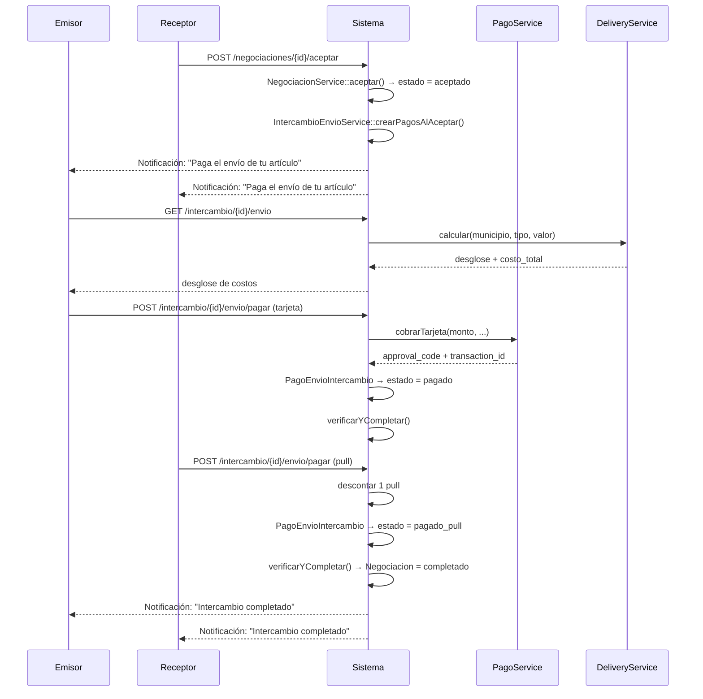
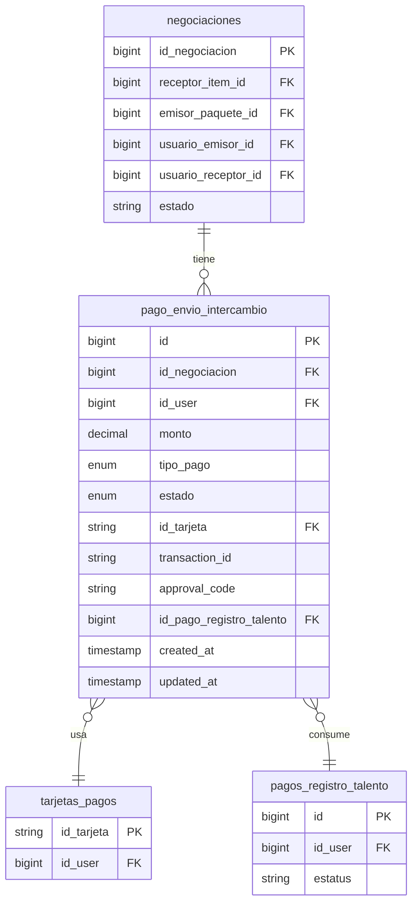

# Design Document — intercambio-envio-pago

## Overview

Cuando una negociación pasa al estado **"aceptado"**, CambialóRD debe cobrar el envío de ambos artículos antes de marcar el intercambio como **"completado"**. Este documento describe la arquitectura, los modelos, los servicios y los contratos de API necesarios para implementar ese flujo.

Caso especial: si uno de los artículos es de **categoría 29** (talento/servicio), ese participante no paga envío físico; en cambio se descuenta **1 unidad de pull** de su saldo en `pagos_registro_talento`.

### Flujo de alto nivel



---

## Architecture

El feature se integra en la arquitectura existente de CambialóRD sin romper ningún contrato actual.

```
┌─────────────────────────────────────────────────────────────┐
│  Web / API (Laravel)                                        │
│                                                             │
│  IntercambioEnvioController  ←→  IntercambioEnvioService   │
│                                        │                    │
│                          ┌─────────────┼──────────────┐    │
│                          ▼             ▼              ▼    │
│                    DeliveryService  PagoService  NegociacionService │
│                          │             │              │    │
│                          ▼             ▼              ▼    │
│                    delivery_zonas  tarjetas_pagos  negociaciones │
│                    delivery_config                           │
│                                                             │
│  PagoEnvioIntercambio (nuevo modelo)                        │
│  ← pago_envio_intercambio (nueva tabla)                     │
└─────────────────────────────────────────────────────────────┘

┌─────────────────────────────────────────────────────────────┐
│  Mobile API (mobil/api — Laravel Sanctum)                   │
│                                                             │
│  IntercambioEnvioApiController  ←→  (misma lógica de negocio) │
│  Rutas: /api/intercambio/{id}/envio/*                       │
└─────────────────────────────────────────────────────────────┘

┌─────────────────────────────────────────────────────────────┐
│  Admin Panel (Blade)                                        │
│                                                             │
│  AdminComprasController::showIntercambio()                  │
│  → admin/intercambios/show.blade.php (actualizado)          │
└─────────────────────────────────────────────────────────────┘
```

### Decisiones de diseño

- **`IntercambioEnvioService` como orquestador central**: toda la lógica de negocio vive aquí; el controlador web y el controlador de la API móvil son delegadores delgados.
- **Transacción de BD en `verificarYCompletar`**: se usa `DB::transaction` con `lockForUpdate` para evitar condiciones de carrera cuando ambos pagos llegan casi simultáneamente.
- **Sin reembolso automático en pull**: el descuento de pull es una operación local en BD; si falla el registro posterior, se revierte dentro de la misma transacción.
- **Reembolso automático en tarjeta**: igual que `CheckoutService`, si el cobro se aprueba pero el registro en BD falla, se intenta reembolso automático vía `PagoService::reembolsar()`.

---

## Components and Interfaces

### 1. `IntercambioEnvioService`

```php
namespace App\Services;

class IntercambioEnvioService
{
    /**
     * Crea los 2 registros PagoEnvioIntercambio (pendiente) y notifica a ambas partes.
     * Llamado desde NegociacionService::aceptar().
     */
    public function crearPagosAlAceptar(Negociacion $neg): void;

    /**
     * Calcula el costo de envío para el artículo del usuario en esta negociación.
     * Retorna desglose de DeliveryService o indica que aplica pull (cat. 29).
     *
     * @return array{
     *   success: bool,
     *   tipo_pago: 'tarjeta'|'pull',
     *   costo_envio_total?: float,
     *   desglose?: array,
     *   message?: string
     * }
     */
    public function calcularCosto(int $userId, int $negociacionId): array;

    /**
     * Cobra el envío con tarjeta guardada y actualiza el registro a 'pagado'.
     * Llama a verificarYCompletar() al final.
     *
     * @return array{success: bool, message: string, approval_code?: string}
     */
    public function pagarConTarjeta(
        int $userId,
        int $negociacionId,
        string $idTarjeta,
        ?string $cvv,
        string $clientIp
    ): array;

    /**
     * Descuenta 1 pull y actualiza el registro a 'pagado_pull'.
     * Llama a verificarYCompletar() al final.
     *
     * @return array{success: bool, message: string}
     */
    public function pagarConPull(int $userId, int $negociacionId): array;

    /**
     * Verifica si ambos PagoEnvioIntercambio están confirmados.
     * Si sí, actualiza la Negociacion a 'completado' y notifica a ambas partes.
     * Ejecutado dentro de una transacción de BD.
     */
    public function verificarYCompletar(int $negociacionId): void;

    /**
     * Retorna el estado de los dos pagos de envío para el usuario.
     *
     * @return array{
     *   success: bool,
     *   mi_pago: array,
     *   otro_pago: array
     * }
     */
    public function obtenerEstado(int $userId, int $negociacionId): array;
}
```

### 2. `IntercambioEnvioController` (web)

| Método | Ruta | Descripción |
|--------|------|-------------|
| `GET` | `/intercambio/{negociacionId}/envio` | Calcular costo de envío |
| `POST` | `/intercambio/{negociacionId}/envio/pagar` | Pagar (tarjeta o pull) |
| `GET` | `/intercambio/{negociacionId}/envio/estado` | Consultar estado de ambos pagos |

### 3. `IntercambioEnvioApiController` (mobil/api)

Mismos 3 endpoints bajo `/api/intercambio/{negociacionId}/envio/*`, protegidos con `auth:sanctum`.

### 4. `NegociacionService::aceptar()` — extensión

```php
// Antes:
$neg->update(['estado' => 'aceptado']);

// Después:
$neg->update(['estado' => 'aceptado']);
app(IntercambioEnvioService::class)->crearPagosAlAceptar($neg);
```

### 5. `AdminComprasController::showIntercambio()` — extensión

Carga adicionalmente `pagoEnvios` (relación `hasMany` en `Negociacion`) y los pasa a la vista.

---

## Data Models

### Nueva tabla: `pago_envio_intercambio`

```sql
CREATE TABLE pago_envio_intercambio (
    id                      BIGINT UNSIGNED AUTO_INCREMENT PRIMARY KEY,
    id_negociacion          BIGINT UNSIGNED NOT NULL,
    id_user                 BIGINT UNSIGNED NOT NULL,
    monto                   DECIMAL(10,2)   NOT NULL DEFAULT 0.00,
    tipo_pago               ENUM('tarjeta','pull') NOT NULL,
    estado                  ENUM('pendiente','pagado','pagado_pull') NOT NULL DEFAULT 'pendiente',
    id_tarjeta              VARCHAR(255)    NULL,
    transaction_id          VARCHAR(255)    NULL,
    approval_code           VARCHAR(255)    NULL,
    id_pago_registro_talento BIGINT UNSIGNED NULL,
    created_at              TIMESTAMP       NULL,
    updated_at              TIMESTAMP       NULL,

    CONSTRAINT fk_pei_negociacion
        FOREIGN KEY (id_negociacion) REFERENCES negociaciones(id_negociacion),
    CONSTRAINT fk_pei_user
        FOREIGN KEY (id_user) REFERENCES users(id),
    CONSTRAINT fk_pei_tarjeta
        FOREIGN KEY (id_tarjeta) REFERENCES tarjetas_pagos(id_tarjeta),
    CONSTRAINT fk_pei_pull
        FOREIGN KEY (id_pago_registro_talento) REFERENCES pagos_registro_talento(id)
);
```

### Nuevo modelo: `PagoEnvioIntercambio`

```php
namespace App\Models;

use Illuminate\Database\Eloquent\Model;

class PagoEnvioIntercambio extends Model
{
    protected $table    = 'pago_envio_intercambio';
    protected $fillable = [
        'id_negociacion', 'id_user', 'monto', 'tipo_pago', 'estado',
        'id_tarjeta', 'transaction_id', 'approval_code', 'id_pago_registro_talento',
    ];

    public function negociacion()
    {
        return $this->belongsTo(Negociacion::class, 'id_negociacion', 'id_negociacion');
    }

    public function usuario()
    {
        return $this->belongsTo(User::class, 'id_user');
    }

    public function tarjeta()
    {
        return $this->belongsTo(TarjetaPago::class, 'id_tarjeta', 'id_tarjeta');
    }

    public function pagoRegistroTalento()
    {
        return $this->belongsTo(PagoRegistroTalento::class, 'id_pago_registro_talento');
    }
}
```

### Extensión del modelo `Negociacion`

```php
// Agregar relación en Negociacion.php:
public function pagoEnvios()
{
    return $this->hasMany(PagoEnvioIntercambio::class, 'id_negociacion', 'id_negociacion');
}
```

### Diagrama entidad-relación (nuevo)



---

## API Contracts

### GET `/intercambio/{negociacionId}/envio`

Calcula el costo de envío del artículo del usuario autenticado.

**Response 200 — artículo físico:**
```json
{
  "success": true,
  "tipo_pago": "tarjeta",
  "costo_envio_total": 850.00,
  "desglose": {
    "precio_base_proveedor": 600.00,
    "costo_flete": 660.00,
    "costo_plataforma": 60.00,
    "costo_seguro": 75.00,
    "costo_manejo": 55.00
  }
}
```

**Response 200 — artículo de servicio (cat. 29):**
```json
{
  "success": true,
  "tipo_pago": "pull",
  "pull_disponible": 3,
  "mensaje": "Se descontará 1 unidad de pull de tu saldo."
}
```

**Response 422 — sin dirección:**
```json
{
  "success": false,
  "message": "Debes registrar una dirección predeterminada antes de calcular el envío."
}
```

---

### POST `/intercambio/{negociacionId}/envio/pagar`

**Request — pago con tarjeta:**
```json
{
  "id_tarjeta": "uuid-de-la-tarjeta",
  "cvv": "123"
}
```

**Request — pago con pull (cat. 29, sin campos adicionales):**
```json
{}
```

**Response 200 — éxito tarjeta:**
```json
{
  "success": true,
  "message": "Pago de envío procesado correctamente.",
  "approval_code": "AUTH123456"
}
```

**Response 200 — éxito pull:**
```json
{
  "success": true,
  "message": "Se descontó 1 unidad de pull. Envío confirmado."
}
```

**Response 422 — pago ya realizado:**
```json
{
  "success": false,
  "message": "El envío de este intercambio ya fue pagado."
}
```

**Response 422 — pull insuficiente:**
```json
{
  "success": false,
  "message": "No tienes créditos pull disponibles. Adquiere un plan para continuar."
}
```

---

### GET `/intercambio/{negociacionId}/envio/estado`

**Response 200:**
```json
{
  "success": true,
  "mi_pago": {
    "estado": "pagado",
    "monto": 850.00,
    "tipo_pago": "tarjeta",
    "fecha_pago": "2025-01-15T14:30:00Z"
  },
  "otro_pago": {
    "estado": "pendiente",
    "monto": 0,
    "tipo_pago": "pull",
    "fecha_pago": null
  }
}
```

**Response 403 — no participante:**
```json
{
  "success": false,
  "message": "No tienes acceso a esta negociación."
}
```

---

## Correctness Properties

*A property is a characteristic or behavior that should hold true across all valid executions of a system — essentially, a formal statement about what the system should do. Properties serve as the bridge between human-readable specifications and machine-verifiable correctness guarantees.*

### Property 1: Creación de registros al aceptar

*Para cualquier* negociación que pase al estado "aceptado", el sistema debe crear exactamente 2 registros `PagoEnvioIntercambio` — uno con `id_user = usuario_emisor_id` y otro con `id_user = usuario_receptor_id` — ambos en estado "pendiente".

**Validates: Requirements 1.1**

---

### Property 2: Cálculo de costo retorna desglose completo

*Para cualquier* usuario con dirección predeterminada registrada y artículo físico (categoría ≠ 29), la respuesta de `calcularCosto` debe contener todos los campos del desglose: `precio_base_proveedor`, `costo_flete`, `costo_plataforma`, `costo_seguro`, `costo_manejo` y `costo_envio_total`.

**Validates: Requirements 2.1, 2.2**

---

### Property 3: Categoría 29 omite delivery y retorna pull

*Para cualquier* usuario cuyo artículo en la negociación tenga `id_categoria_item = 29`, `calcularCosto` debe retornar `tipo_pago = 'pull'` y no debe incluir campos de desglose de delivery.

**Validates: Requirements 2.3, 4.1**

---

### Property 4: Pago con tarjeta actualiza estado y guarda credenciales

*Para cualquier* pago de envío aprobado por `PagoService`, el registro `PagoEnvioIntercambio` del usuario debe pasar a estado "pagado" y los campos `transaction_id` y `approval_code` deben ser no nulos y coincidir con los retornados por el proveedor.

**Validates: Requirements 3.2, 3.6**

---

### Property 5: Pago rechazado mantiene estado pendiente

*Para cualquier* intento de cobro rechazado por `PagoService`, el registro `PagoEnvioIntercambio` debe permanecer en estado "pendiente" y el campo `transaction_id` debe seguir siendo nulo.

**Validates: Requirements 3.3**

---

### Property 6: Descuento de pull actualiza estado y referencia

*Para cualquier* usuario con al menos 1 pull disponible que confirme pago pull, el sistema debe: (a) cambiar exactamente 1 fila de `pagos_registro_talento` de `estatus = 'aprobado'` a `estatus = 'usado'`, y (b) actualizar el `PagoEnvioIntercambio` a estado "pagado_pull" con `id_pago_registro_talento` apuntando a esa fila.

**Validates: Requirements 4.2, 4.4**

---

### Property 7: Transición a completado solo cuando ambos pagos confirmados

*Para cualquier* negociación, el estado "completado" solo debe alcanzarse cuando los 2 registros `PagoEnvioIntercambio` asociados estén en estado "pagado" o "pagado_pull". Mientras solo uno esté confirmado, el estado debe permanecer "aceptado".

**Validates: Requirements 5.1, 5.2, 5.3**

---

### Property 8: Consulta de estado retorna ambos pagos

*Para cualquier* usuario participante (emisor o receptor) de una negociación aceptada, `obtenerEstado` debe retornar exactamente 2 objetos de pago: `mi_pago` (del usuario consultante) y `otro_pago` (del otro participante), cada uno con los campos `estado`, `monto`, `tipo_pago` y `fecha_pago`.

**Validates: Requirements 6.1, 6.2**

---

## Error Handling

| Escenario | Comportamiento |
|-----------|---------------|
| Dirección predeterminada no registrada | Retorna error 422 con mensaje descriptivo; no se crea `PagoEnvioIntercambio` |
| Zona de delivery no encontrada | Retorna error 422 con el municipio que falló |
| Tarjeta no pertenece al usuario | Retorna error 403; no se intenta cobro |
| Cobro rechazado por proveedor | Retorna error 422 con mensaje del proveedor; registro permanece "pendiente" |
| Cobro aprobado pero falla registro en BD | Se intenta reembolso automático vía `PagoService::reembolsar()`; se loguea con `Log::critical` |
| Pull insuficiente | Retorna error 422; no se modifica ningún registro |
| Pago ya realizado (doble submit) | Retorna error 422 "ya fue pagado"; idempotente |
| Usuario no participante consulta estado | Retorna 403 |
| `verificarYCompletar` con condición de carrera | `DB::transaction` + `lockForUpdate` garantiza atomicidad |

---

## Testing Strategy

### Enfoque dual

Se usan **pruebas unitarias/de integración** para ejemplos concretos y casos borde, y **pruebas basadas en propiedades** (PBT) para validar invariantes universales.

### Librería PBT

Para PHP se usará **[eris](https://github.com/giorgiosironi/eris)** (o alternativamente **[php-quickcheck](https://github.com/steos/php-quickcheck)**). Cada test de propiedad debe ejecutar mínimo **100 iteraciones**.

### Pruebas unitarias (ejemplos y casos borde)

- `IntercambioEnvioServiceTest`
  - Negociación con ambos artículos físicos → 2 registros pendiente creados
  - Negociación producto vs. servicio → registro pull + registro tarjeta
  - Cobro rechazado → registro permanece pendiente
  - Pull = 0 → error descriptivo
  - Pago ya realizado → error idempotente
  - `verificarYCompletar` con solo 1 pago → estado sigue "aceptado"
  - `verificarYCompletar` con ambos pagos → estado "completado"

- `IntercambioEnvioControllerTest`
  - GET envio sin dirección → 422
  - POST pagar con tarjeta ajena → 403
  - GET estado de negociación ajena → 403

### Pruebas de propiedad (PBT)

Cada propiedad del diseño se implementa como un test PBT con el tag indicado:

```
// Feature: intercambio-envio-pago, Property 1: Creación de registros al aceptar
// Feature: intercambio-envio-pago, Property 2: Cálculo de costo retorna desglose completo
// Feature: intercambio-envio-pago, Property 3: Categoría 29 omite delivery y retorna pull
// Feature: intercambio-envio-pago, Property 4: Pago con tarjeta actualiza estado y guarda credenciales
// Feature: intercambio-envio-pago, Property 5: Pago rechazado mantiene estado pendiente
// Feature: intercambio-envio-pago, Property 6: Descuento de pull actualiza estado y referencia
// Feature: intercambio-envio-pago, Property 7: Transición a completado solo cuando ambos pagos confirmados
// Feature: intercambio-envio-pago, Property 8: Consulta de estado retorna ambos pagos
```

Cada propiedad debe tener **un único test PBT** que la valide con generadores de datos aleatorios (usuarios, negociaciones, montos, municipios).
