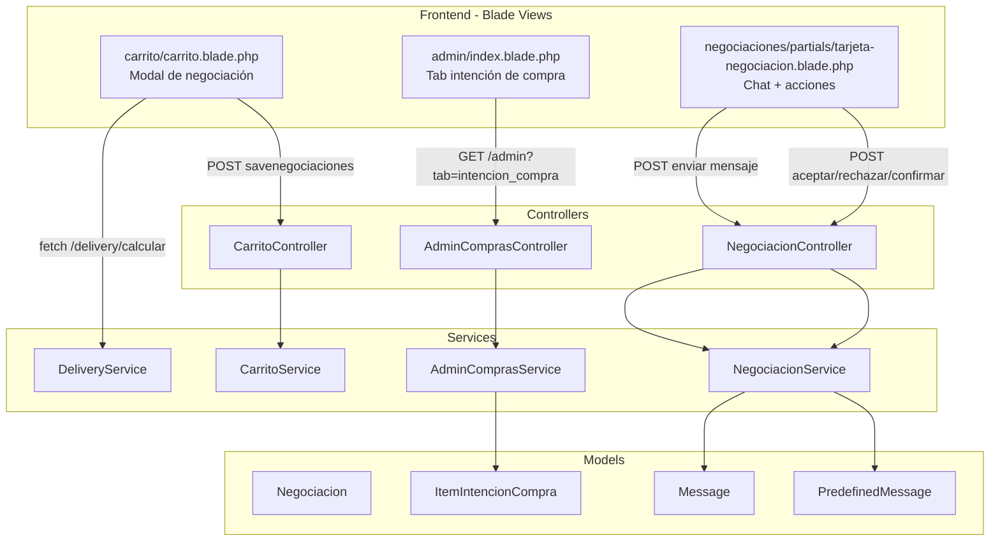
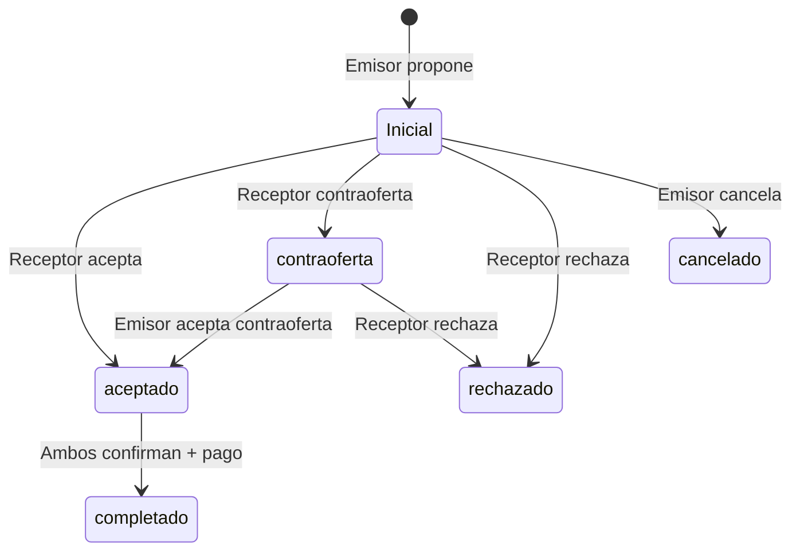
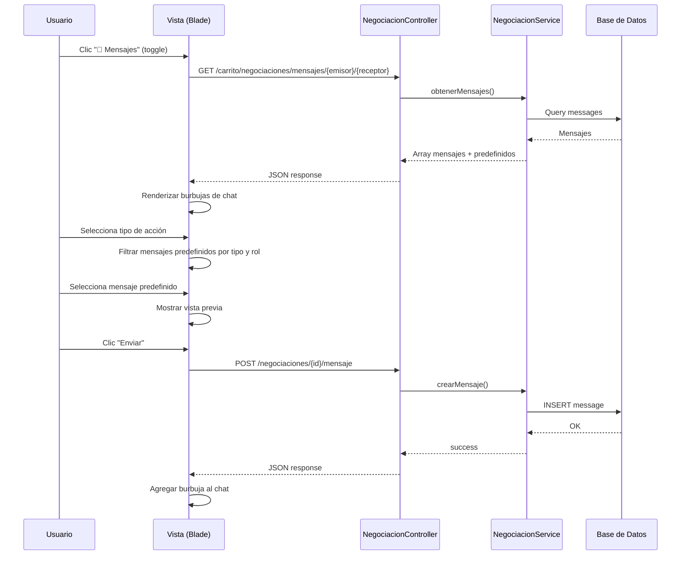

# Documento de Diseño — Mejoras al Flujo de Negociación

## Visión General

Este documento describe el diseño técnico para tres áreas de mejora en el flujo de negociación de CambialoRD:

1. **Corrección de bugs en el modal de negociación del carrito** — Arreglar la ruta de cálculo de delivery (usar `/delivery/calcular` en vez de `/api/delivery/calcular`), enviar el valor de AccionPredefinido al backend, y mejorar la validación visual de campos requeridos.
2. **Nueva pestaña de intención de compra en admin** — Agregar una pestaña `intencion_compra` al panel `/admin` que muestre artículos en carritos no comprados.
3. **Chat con mensajes predefinidos y aprobación bilateral en `/negociaciones`** — Integrar una interfaz de chat con mensajes predefinidos, selector de acción, y botones de aprobación/rechazo directamente en la tarjeta de negociación.

### Decisiones de Diseño Clave

- Se reutiliza la infraestructura existente: `NegociacionService`, `AdminComprasService`, `CarritoService`, modelo `Message`, modelo `PredefinedMessage`.
- No se toca `stats.blade.php` (frágil).
- Se usan estilos inline o clases Astro CSS existentes (`bg-primary`, `bg-secondary`, `text-primary`, etc.).
- El cálculo de delivery usa la ruta web `/delivery/calcular` (ya existente en `routes/web.php`).
- Los mensajes de chat se almacenan en la tabla `messages` existente vía `NegociacionService::crearMensaje()`.

## Arquitectura



### Flujo de Estados de Negociación (existente, sin cambios)



## Componentes e Interfaces

### Componente 1: Corrección del Modal de Negociación del Carrito

**Archivos afectados:**
- `resources/views/carrito/carrito.blade.php` (o el partial del modal de negociación)

**Cambios:**

1. **Ruta de delivery**: Cambiar la URL de fetch de `/api/delivery/calcular` a `/delivery/calcular` en el JavaScript del modal.

2. **Campo oculto accionInput**: Agregar un `<input type="hidden" name="accionInput" id="accionInput">` dentro del formulario del modal. Agregar un event listener `change` al select de AccionPredefinido que actualice el valor del hidden input.

3. **Validación visual inline**: Reemplazar los `alert()` de validación por lógica que:
   - Agregue un borde rojo (`border: 2px solid #ef4444`) y un `<span>` de error debajo de cada campo inválido.
   - Remueva la indicación de error en el evento `input` o `change` del campo.

**Interfaz JavaScript (pseudocódigo):**
```javascript
// Delivery: cambiar URL
fetch('/delivery/calcular?pueblo=' + encodeURIComponent(municipio) + '&tipo=persona&valor=0')

// AccionPredefinido: sincronizar hidden input
document.getElementById('selectAccion').addEventListener('change', function() {
    document.getElementById('accionInput').value = this.value;
});

// Validación inline
function validarCampo(campo, mensaje) {
    campo.style.border = '2px solid #ef4444';
    // insertar span.error-msg debajo
}
function limpiarError(campo) {
    campo.style.border = '';
    // remover span.error-msg
}
```

### Componente 2: Pestaña Intención de Compra en Admin

**Archivos afectados:**
- `app/Services/AdminComprasService.php` — ya tiene `queryIntencionCompra()` y la pestaña existe en la vista.
- `resources/views/admin/partials/tabla-intencion-compra.blade.php` — partial existente o a crear.
- `resources/views/admin/index.blade.php` — ya incluye la pestaña `intencion_compra`.

**Análisis del código existente:**
La pestaña `intencion_compra` ya está implementada en `AdminComprasService::obtenerDatosPanelPrincipal()` y en `admin/index.blade.php`. El partial `tabla-intencion-compra` ya se incluye. Solo necesitamos verificar que muestre las columnas correctas: usuario, artículo, cantidad, precio unitario y total.

**Interfaz del partial `tabla-intencion-compra.blade.php`:**

| Columna | Fuente |
|---------|--------|
| Usuario | `$item->carrito->usuario->nombres` |
| Artículo | `$item->item->item` |
| Cantidad | `$item->cantidad` |
| Precio unitario | `$item->item->valor` |
| Total | `$item->item->valor * $item->cantidad` |

La query en `AdminComprasService` ya filtra por `tipo_trans` IN (1, 3) y pagina a 20 registros.

### Componente 3: Chat con Mensajes Predefinidos en Negociaciones

**Archivos afectados:**
- `resources/views/negociaciones/partials/tarjeta-negociacion.blade.php` — agregar sección de chat.
- `app/Http/Controllers/NegociacionController.php` — nuevo endpoint para enviar mensaje desde negociación.
- `app/Services/NegociacionService.php` — reutilizar `crearMensaje()`.

**Diseño de la sección de chat en la tarjeta:**

Dentro de cada tarjeta de negociación (para estados `Inicial`, `aceptado`, `contraoferta`), se agrega un bloque colapsable "💬 Mensajes" que contiene:

1. **Historial de mensajes** — Cargado vía AJAX (`GET /carrito/negociaciones/mensajes/{emisor}/{receptor}`). Se muestra en formato de burbujas (alineadas a la derecha si es propio, izquierda si es del otro).

2. **Selector de acción predefinida** — Un `<select>` con los tipos distintos de `PredefinedMessage` (campo `tipo`). Al seleccionar un tipo, se filtran los mensajes predefinidos disponibles.

3. **Mensajes predefinidos filtrados** — Botones o lista de mensajes predefinidos filtrados por tipo y por rol del usuario (`emisor`, `receptor`, `general`). Al hacer clic, se muestra una vista previa.

4. **Vista previa y envío** — Al seleccionar un mensaje predefinido, se muestra el texto en un área de preview. Un botón "Enviar" hace POST al backend.

5. **Botones de acción** — Los botones de Aceptar/Rechazar/Aprobar ya existen en la tarjeta y se mantienen junto a la interfaz de mensajes.

**Nuevo endpoint:**
```
POST /negociaciones/{id}/mensaje
Body: { mensaje: string, tipo_accion: string|null }
```

Se agrega una ruta en el grupo `negociaciones` y un método en `NegociacionController` que llama a `NegociacionService::crearMensaje()`.

**Flujo de interacción:**



## Modelos de Datos

### Modelos Existentes (sin cambios en schema)

**Negociacion** (`negociaciones`)
- `id_negociacion` (PK)
- `receptor_item_id`, `emisor_paquete_id`
- `usuario_emisor_id`, `usuario_receptor_id`
- `mensaje_inicial`, `monto_oferta`, `monto_contra_oferta`
- `estado` (Inicial, aceptado, contraoferta, rechazado, cancelado, completado)
- `emisor_confirmado`, `receptor_confirmado` (boolean)
- `pago_emisor`, `pago_receptor` (boolean)
- `items_ofrecidos` (JSON array)
- `fecha_creacion`

**Message** (`messages`)
- `id` (PK)
- `id_emisor`, `id_receptor` (FK → users)
- `id_oferta` (FK → items, usado como contexto del item negociado)
- `id_paquete` (FK → paquetes, nullable)
- `mensaje` (text)
- `leido` (boolean)
- `created_at`, `updated_at`

**PredefinedMessage** (`predefined_messages`)
- `id` (PK)
- `titulo` (string)
- `mensaje` (text)
- `tipo` (string — categoría/acción: e.g. "contraoferta", "consulta", "aceptacion")
- `rol` (string — "emisor", "receptor", "general")
- `activo` (boolean)

**ItemIntencionCompra** (`items_intencion_compra`)
- `id_item_intencion_compra` (PK)
- `id_carrito` (FK → carritos)
- `id_item` (FK → items)
- `cantidad`, `es_seleccionado`, `descuento`

### Relaciones Clave

- `Negociacion` → `Item` (receptor_item_id)
- `Negociacion` → `User` (usuario_emisor_id, usuario_receptor_id)
- `Message` → `User` (id_emisor, id_receptor)
- `Message` → `Item` (id_oferta)
- `ItemIntencionCompra` → `Carrito` → `User`
- `ItemIntencionCompra` → `Item`

No se requieren migraciones nuevas. Todos los modelos y tablas ya existen.


## Propiedades de Correctitud

*Una propiedad es una característica o comportamiento que debe mantenerse verdadero en todas las ejecuciones válidas de un sistema — esencialmente, una declaración formal sobre lo que el sistema debe hacer. Las propiedades sirven como puente entre especificaciones legibles por humanos y garantías de correctitud verificables por máquina.*

### Propiedad 1: Cálculo de delivery retorna costo válido para municipios conocidos

*Para cualquier* municipio registrado en una zona de delivery activa y cualquier valor de artículo ≥ 0, `DeliveryService::calcular()` debe retornar `success: true` con un `costo_envio_total` ≥ 0 y un desglose completo (costo_flete, costo_plataforma, costo_seguro, costo_manejo).

**Valida: Requisitos 1.2**

### Propiedad 2: Query de intención de compra filtra correctamente por tipo de transacción y búsqueda

*Para cualquier* conjunto de items en carritos con distintos `tipo_trans` y cualquier término de búsqueda, la query de intención de compra en `AdminComprasService` debe retornar únicamente items con `tipo_trans` IN (1, 3), y cuando hay un término de búsqueda, todos los resultados deben coincidir con el término en al menos uno de: nombre del artículo, nombre del usuario o email del usuario.

**Valida: Requisitos 4.3, 4.4**

### Propiedad 3: Filtrado de mensajes predefinidos por rol y tipo

*Para cualquier* rol de usuario (emisor, receptor) y cualquier tipo de acción seleccionado, los mensajes predefinidos retornados deben incluir solo aquellos cuyo campo `rol` sea igual al rol del usuario o "general", y cuyo campo `tipo` coincida con el tipo seleccionado (si se seleccionó uno).

**Valida: Requisitos 5.2, 6.2**

### Propiedad 4: Round-trip de persistencia de mensajes de negociación

*Para cualquier* mensaje válido (no vacío) enviado entre dos usuarios en el contexto de una negociación, al almacenarlo vía `NegociacionService::crearMensaje()` y luego consultarlo vía `obtenerMensajes()`, el mensaje recuperado debe contener el mismo texto, los mismos IDs de emisor/receptor, y el ID del item asociado.

**Valida: Requisitos 5.4, 6.3**

### Propiedad 5: Visibilidad de acciones según estado de negociación y rol

*Para cualquier* negociación y cualquier usuario participante (emisor o receptor), las acciones visibles deben cumplir:
- Si estado ∈ {Inicial, contraoferta} y usuario es receptor → mostrar Aceptar y Rechazar
- Si estado = "aceptado" y usuario no ha confirmado → mostrar Aprobar
- Si estado ∈ {Inicial, aceptado, contraoferta} → mostrar sección de mensajes
- En cualquier otro caso → no mostrar acciones de modificación

**Valida: Requisitos 5.1, 7.1, 7.2**

### Propiedad 6: Transiciones de estado de negociación preservan invariantes

*Para cualquier* negociación en estado válido:
- Aceptar solo es posible desde estados {Inicial, contraoferta} y solo por el receptor → estado resultante = "aceptado"
- Rechazar solo es posible desde estados {Inicial, contraoferta} y solo por el receptor → estado resultante = "rechazado"
- Cuando ambos `emisor_confirmado` y `receptor_confirmado` son true y ambos pagaron → estado resultante = "completado"
- Después de rechazar, no se pueden enviar nuevos mensajes en esa negociación

**Valida: Requisitos 7.3, 7.4**

## Manejo de Errores

### Modal del Carrito (Requisitos 1-3)

| Escenario | Manejo |
|-----------|--------|
| `/delivery/calcular` retorna error o 404 | Mostrar mensaje inline "No se pudo calcular el envío" sin bloquear el formulario |
| Campos requeridos vacíos al enviar | Resaltar campos con borde rojo + mensaje inline debajo. No usar `alert()` |
| Error de red al enviar negociación | Mostrar mensaje de error en el modal sin cerrar |
| AccionPredefinido no seleccionado | Enviar sin acción (campo nullable en backend) |

### Panel Admin (Requisito 4)

| Escenario | Manejo |
|-----------|--------|
| No hay items de intención de compra | Mostrar mensaje "No hay datos" en la tabla |
| Error en query de búsqueda | Mostrar tabla vacía con mensaje de error |

### Chat de Negociaciones (Requisitos 5-7)

| Escenario | Manejo |
|-----------|--------|
| Error al cargar mensajes (AJAX) | Mostrar "Error al cargar mensajes. Intenta de nuevo." |
| Error al enviar mensaje | Mostrar error inline sin perder el mensaje escrito |
| Negociación rechazada mientras se escribe | Deshabilitar envío, mostrar estado actualizado |
| Usuario intenta aceptar negociación ya cambiada | Backend retorna error, frontend muestra mensaje y recarga |
| Doble clic en Aceptar/Rechazar | Deshabilitar botón después del primer clic |

## Estrategia de Testing

### Enfoque Dual

Se utilizan tanto tests unitarios como tests basados en propiedades (property-based testing):

- **Tests unitarios**: Verifican ejemplos específicos, edge cases y condiciones de error.
- **Tests de propiedades**: Verifican propiedades universales con inputs generados aleatoriamente.

### Librería de Property-Based Testing

Se usará **PHPUnit** con el paquete **`spatie/phpunit-snapshot-assertions`** para snapshots y **`innmind/property-based-testing`** o generadores manuales con `faker` para property-based testing en PHP. Dado que el ecosistema PHP no tiene una librería PBT tan madura como QuickCheck, se implementarán los tests de propiedades usando loops con datos generados por Faker (mínimo 100 iteraciones por propiedad).

**Configuración:**
- Mínimo 100 iteraciones por test de propiedad
- Cada test de propiedad debe referenciar su propiedad del documento de diseño
- Formato de tag: `Feature: negotiation-flow-improvements, Property {number}: {texto}`

### Tests Unitarios

| Test | Tipo | Cubre |
|------|------|-------|
| Delivery URL es `/delivery/calcular` en el JS del modal | Example | Req 1.1 |
| Campo hidden `accionInput` existe en el formulario | Example | Req 2.1 |
| Pestaña intención de compra accesible en `/admin?tab=intencion_compra` | Example | Req 4.1 |
| Tabla muestra columnas correctas | Example | Req 4.2 |
| Selector de acción predefinida presente en tarjeta activa | Example | Req 6.1 |
| Paginación retorna máximo 20 registros | Example | Req 4.5 |

### Tests de Propiedades

| Test | Propiedad | Iteraciones |
|------|-----------|-------------|
| `DeliveryService::calcular()` retorna costo válido para municipios conocidos | Propiedad 1 | 100 |
| Query intención de compra filtra por tipo_trans y búsqueda | Propiedad 2 | 100 |
| Filtrado de mensajes predefinidos por rol y tipo | Propiedad 3 | 100 |
| Round-trip de persistencia de mensajes | Propiedad 4 | 100 |
| Visibilidad de acciones según estado y rol | Propiedad 5 | 100 |
| Transiciones de estado preservan invariantes | Propiedad 6 | 100 |

Cada test de propiedad debe incluir un comentario con el tag:
```php
// Feature: negotiation-flow-improvements, Property 1: Cálculo de delivery retorna costo válido para municipios conocidos
```
