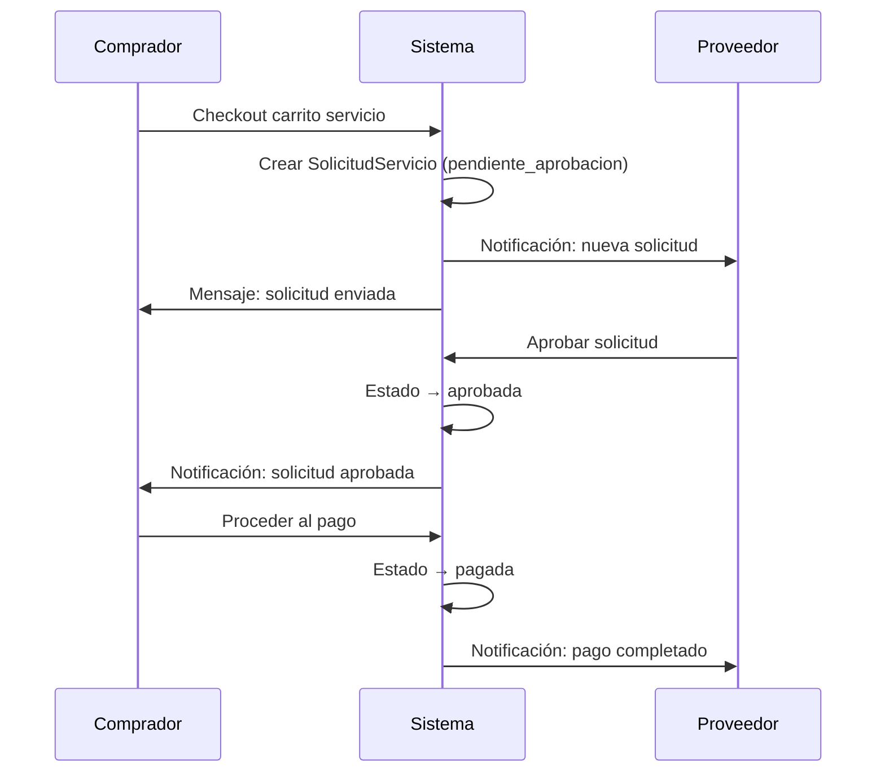

# Design Document: Service Purchase Approval

## Overview

Este diseño introduce un flujo de aprobación previa al pago para servicios/talentos (categoría 29) en CambialóRD. Cuando un comprador intenta pagar un servicio, en lugar de proceder directamente al cobro, el sistema crea una `SolicitudServicio` en estado `pendiente_aprobacion`. El proveedor del servicio gestiona estas solicitudes desde una nueva vista `/mis-ventas-talentos`, pudiendo aprobar o rechazar cada una. Solo tras la aprobación el comprador puede completar el pago.

El flujo de productos (categorías distintas a 29) permanece sin cambios.

### Flujo Principal



## Architecture

La solución se integra en la arquitectura existente de Laravel siguiendo el patrón Controller → Service → Model ya establecido en el flujo de negociaciones (intercambios).

### Componentes Afectados

1. **Nuevo modelo `SolicitudServicio`** — Representa la solicitud de compra pendiente de aprobación
2. **Nuevo `SolicitudServicioService`** — Lógica de negocio: crear, aprobar, rechazar solicitudes y enviar notificaciones
3. **Nuevo `SolicitudServicioController`** — Endpoints HTTP para la vista del proveedor y acciones
4. **Modificación de `CheckoutService`** — Interceptar checkout de carrito tipo `servicio` para crear solicitudes en lugar de cobrar
5. **Modificación de `CarritoController`** — Redirigir al comprador con mensaje de confirmación tras crear solicitudes
6. **Nueva vista `mis-ventas-talentos.blade.php`** — Panel del proveedor para gestionar solicitudes
7. **Modificación de `checkout.blade.php`** — Mostrar info del proveedor para servicios
8. **Nueva migración** — Tabla `solicitudes_servicio`
9. **Nuevas rutas** — CRUD de solicitudes y vista del proveedor

### Decisiones de Diseño

- **Reutilizar el patrón de negociaciones**: La vista `mis-ventas-talentos` sigue el mismo layout y estructura de tabs que `mis-intercambios`, reduciendo la curva de aprendizaje del usuario y la complejidad de desarrollo.
- **No bloquear inventario**: Múltiples compradores pueden solicitar el mismo servicio simultáneamente. El proveedor decide a quién aprobar. Esto es coherente con la naturaleza de los servicios (no tienen stock físico limitado de la misma manera).
- **Interceptar en CheckoutService**: En lugar de crear un nuevo flujo paralelo, se modifica el punto de entrada existente (`CheckoutService::procesar`) para desviar el flujo cuando el carrito es de tipo `servicio`. Esto minimiza cambios en el frontend.
- **Notificaciones via NuevaNotificacion + Message**: Se reutiliza el sistema existente de notificaciones, consistente con cómo funcionan las negociaciones.

## Components and Interfaces

### SolicitudServicioController

```php
class SolicitudServicioController extends Controller
{
    // GET /mis-ventas-talentos — Vista principal del proveedor
    public function index(): View

    // POST /solicitudes-servicio/{id}/aprobar — Proveedor aprueba
    public function aprobar(int $id): RedirectResponse

    // POST /solicitudes-servicio/{id}/rechazar — Proveedor rechaza
    public function rechazar(int $id): RedirectResponse
}
```

### SolicitudServicioService

```php
class SolicitudServicioService
{
    // Crea solicitudes para cada item seleccionado del carrito servicio
    public function crearDesdCarrito(int $compradorId, Carrito $carrito): array

    // Proveedor aprueba una solicitud
    public function aprobar(int $proveedorId, int $solicitudId): array

    // Proveedor rechaza una solicitud
    public function rechazar(int $proveedorId, int $solicitudId): array

    // Marca solicitud como pagada tras pago exitoso
    public function marcarPagada(int $solicitudId): void

    // Verifica si un item tiene solicitud aprobada para el comprador
    public function tieneAprobacion(int $compradorId, int $itemId): bool
}
```

### Modificaciones a CheckoutService

```php
// En CheckoutService::procesar(), después de cargar el carrito:
// Si $carrito->tipo === 'servicio', delegar a SolicitudServicioService::crearDesdeCarrito()
// y retornar resultado sin proceder al cobro.
//
// Excepción: si TODOS los items del carrito tienen solicitud aprobada,
// proceder al cobro normal y marcar las solicitudes como pagadas post-pago.
```

### Modificaciones a CarritoController

```php
// En CarritoController::checkout():
// Si el carrito es tipo 'servicio', cargar info del proveedor
// (nombre, municipio) para cada item y pasarla a la vista.
```

### Rutas Nuevas

```php
// En routes/web.php, dentro del grupo auth:
Route::get('/mis-ventas-talentos', [SolicitudServicioController::class, 'index'])
    ->name('solicitudes.index');

Route::post('/solicitudes-servicio/{id}/aprobar', [SolicitudServicioController::class, 'aprobar'])
    ->name('solicitudes.aprobar');

Route::post('/solicitudes-servicio/{id}/rechazar', [SolicitudServicioController::class, 'rechazar'])
    ->name('solicitudes.rechazar');
```

## Data Models

### Nueva Tabla: `solicitudes_servicio`

```sql
CREATE TABLE solicitudes_servicio (
    id_solicitud      BIGINT UNSIGNED AUTO_INCREMENT PRIMARY KEY,
    id_comprador      BIGINT UNSIGNED NOT NULL,  -- FK → users.id
    id_proveedor      BIGINT UNSIGNED NOT NULL,  -- FK → users.id
    id_item           BIGINT UNSIGNED NOT NULL,  -- FK → items.id_item
    id_carrito        BIGINT UNSIGNED NOT NULL,  -- FK → carritos.id_carrito
    cantidad          INT UNSIGNED NOT NULL DEFAULT 1,
    monto_total       DECIMAL(10,2) NOT NULL,
    estado            VARCHAR(30) NOT NULL DEFAULT 'pendiente_aprobacion',
    fecha_creacion    TIMESTAMP NOT NULL DEFAULT CURRENT_TIMESTAMP,
    fecha_actualizacion TIMESTAMP NULL,

    INDEX idx_proveedor_estado (id_proveedor, estado),
    INDEX idx_comprador_estado (id_comprador, estado),
    INDEX idx_item (id_item),

    FOREIGN KEY (id_comprador) REFERENCES users(id),
    FOREIGN KEY (id_proveedor) REFERENCES users(id),
    FOREIGN KEY (id_item) REFERENCES items(id_item),
    FOREIGN KEY (id_carrito) REFERENCES carritos(id_carrito)
) ENGINE=InnoDB DEFAULT CHARSET=utf8mb4 COLLATE=utf8mb4_unicode_ci;
```

**Estados posibles**: `pendiente_aprobacion`, `aprobada`, `rechazada`, `pagada`

### Modelo: SolicitudServicio

```php
class SolicitudServicio extends Model
{
    protected $table = 'solicitudes_servicio';
    protected $primaryKey = 'id_solicitud';
    public $timestamps = false;

    protected $fillable = [
        'id_comprador', 'id_proveedor', 'id_item', 'id_carrito',
        'cantidad', 'monto_total', 'estado',
        'fecha_creacion', 'fecha_actualizacion',
    ];

    protected $casts = [
        'monto_total'          => 'decimal:2',
        'fecha_creacion'       => 'datetime',
        'fecha_actualizacion'  => 'datetime',
    ];

    public function comprador()
    {
        return $this->belongsTo(User::class, 'id_comprador');
    }

    public function proveedor()
    {
        return $this->belongsTo(User::class, 'id_proveedor');
    }

    public function item()
    {
        return $this->belongsTo(Item::class, 'id_item', 'id_item');
    }

    public function carrito()
    {
        return $this->belongsTo(Carrito::class, 'id_carrito', 'id_carrito');
    }
}
```

### Migración

```php
// database/migrations/2026_05_XX_000001_create_solicitudes_servicio_table.php
return new class extends Migration {
    public function up(): void
    {
        Schema::create('solicitudes_servicio', function (Blueprint $table) {
            $table->id('id_solicitud');
            $table->unsignedBigInteger('id_comprador');
            $table->unsignedBigInteger('id_proveedor');
            $table->unsignedBigInteger('id_item');
            $table->unsignedBigInteger('id_carrito');
            $table->unsignedInteger('cantidad')->default(1);
            $table->decimal('monto_total', 10, 2);
            $table->string('estado', 30)->default('pendiente_aprobacion');
            $table->timestamp('fecha_creacion')->useCurrent();
            $table->timestamp('fecha_actualizacion')->nullable();

            $table->index(['id_proveedor', 'estado'], 'idx_proveedor_estado');
            $table->index(['id_comprador', 'estado'], 'idx_comprador_estado');
            $table->index('id_item', 'idx_item');

            $table->foreign('id_comprador')->references('id')->on('users');
            $table->foreign('id_proveedor')->references('id')->on('users');
            $table->foreign('id_item')->references('id_item')->on('items');
            $table->foreign('id_carrito')->references('id_carrito')->on('carritos');
        });
    }

    public function down(): void
    {
        Schema::dropIfExists('solicitudes_servicio');
    }
};
```


## Correctness Properties

*A property is a characteristic or behavior that should hold true across all valid executions of a system — essentially, a formal statement about what the system should do. Properties serve as the bridge between human-readable specifications and machine-verifiable correctness guarantees.*

### Property 1: Service checkout creates solicitudes instead of charging

*For any* service cart (tipo = 'servicio') with one or more selected items, initiating checkout shall create one `SolicitudServicio` per selected item with estado `pendiente_aprobacion`, correct `id_comprador`, `id_proveedor`, `id_item`, `cantidad`, `monto_total`, and `fecha_creacion` — and shall NOT process any payment.

**Validates: Requirements 1.1, 1.2, 7.1**

### Property 2: Product checkout remains unchanged

*For any* product cart (tipo = 'producto' or categoría ≠ 29), initiating checkout shall proceed to the standard payment flow without creating any `SolicitudServicio` records.

**Validates: Requirements 1.5**

### Property 3: Non-blocking concurrent solicitudes

*For any* item with an existing `SolicitudServicio` in estado `pendiente_aprobacion`, another buyer (distinct from the existing solicitud's buyer and the item's owner) shall be able to create a new `SolicitudServicio` for the same item without error.

**Validates: Requirements 1.4**

### Property 4: Service checkout view includes provider info

*For any* service cart checkout view, each selected service item shall include the provider's name and the provider's default address municipality. If the provider has no default address, the text "Ubicación no disponible" shall be displayed instead.

**Validates: Requirements 2.1, 2.2, 2.3**

### Property 5: Provider solicitudes listing is complete and ordered

*For any* provider with solicitudes, accessing the mis-ventas-talentos view shall return all `SolicitudServicio` records where `id_proveedor` matches the provider, ordered by `fecha_creacion` descending. Each solicitud shall include: service name, buyer name, buyer municipality (or "Ubicación no disponible"), monto_total, fecha_creacion, and estado.

**Validates: Requirements 3.2, 3.3, 3.4**

### Property 6: Approval transitions state and notifies buyer

*For any* `SolicitudServicio` in estado `pendiente_aprobacion`, when the provider approves it, the estado shall change to `aprobada` and a notification shall be sent to the buyer.

**Validates: Requirements 4.1, 4.2, 7.2**

### Property 7: State transition guards

*For any* `SolicitudServicio` with estado NOT equal to `pendiente_aprobacion`, attempting to approve or reject it shall fail and the estado shall remain unchanged.

**Validates: Requirements 4.4, 5.5**

### Property 8: Rejection transitions state, notifies buyer, and removes cart item

*For any* `SolicitudServicio` in estado `pendiente_aprobacion`, when the provider rejects it, the estado shall change to `rechazada`, a notification shall be sent to the buyer, and the corresponding item shall be removed from the buyer's service cart.

**Validates: Requirements 5.1, 5.2, 5.3, 7.3**

### Property 9: Payment gate based on approval status

*For any* `SolicitudServicio`, the buyer shall be able to complete payment if and only if the estado is `aprobada`. If the estado is anything other than `aprobada`, the payment shall be blocked.

**Validates: Requirements 6.1, 6.4**

### Property 10: Payment completion transitions state and notifies provider

*For any* `SolicitudServicio` in estado `aprobada`, when the buyer completes payment, the estado shall change to `pagada` and a notification shall be sent to the provider.

**Validates: Requirements 6.2, 6.3, 7.4**

### Property 11: Authorization enforcement

*For any* `SolicitudServicio` and any user, approve/reject actions shall succeed only if the user is the provider of the associated item, and payment shall succeed only if the user is the buyer who created the solicitud. All other users shall receive HTTP 403.

**Validates: Requirements 8.1, 8.2, 8.3**

### Property 12: Self-purchase prevention

*For any* user and any item owned by that user, attempting to create a `SolicitudServicio` for that item shall be rejected.

**Validates: Requirements 8.4**

## Error Handling

### Errores de Validación

| Escenario | Respuesta |
|---|---|
| Comprador intenta checkout de carrito servicio vacío | Redirect con mensaje "No hay ítems seleccionados" |
| Comprador intenta solicitar su propio servicio | Redirect con mensaje "No puedes comprar tu propio servicio" |
| Proveedor intenta aprobar solicitud que no es suya | HTTP 403 |
| Proveedor intenta rechazar solicitud que no es suya | HTTP 403 |
| Comprador intenta pagar solicitud que no es suya | HTTP 403 |
| Proveedor intenta aprobar solicitud no pendiente | Redirect con mensaje "Esta solicitud ya fue procesada" |
| Proveedor intenta rechazar solicitud no pendiente | Redirect con mensaje "Esta solicitud ya fue procesada" |
| Comprador intenta pagar solicitud no aprobada | Redirect con mensaje "La solicitud debe ser aprobada por el proveedor antes de pagar" |
| Solicitud referencia item inactivo | Redirect con mensaje "El servicio ya no está disponible" |

### Errores de Sistema

- **Fallo al crear solicitud**: Se captura la excepción, se loguea con `Log::error()`, y se retorna mensaje genérico al usuario.
- **Fallo al enviar notificación**: No bloquea la operación principal. Se loguea con `Log::warning()` (mismo patrón que `NegociacionService::notificarAdmins`).
- **Fallo de pago post-aprobación**: Se maneja por el `CheckoutService` existente, incluyendo reembolso automático si falla el registro en BD.

## Testing Strategy

### Unit Tests

Los unit tests cubren ejemplos específicos y edge cases:

- Crear solicitud con datos válidos y verificar campos almacenados
- Intentar crear solicitud para item propio → error
- Aprobar solicitud pendiente → estado cambia a `aprobada`
- Rechazar solicitud pendiente → estado cambia a `rechazada` y item eliminado del carrito
- Intentar aprobar solicitud ya aprobada → error
- Intentar pagar solicitud no aprobada → error
- Checkout de carrito producto → flujo normal sin solicitudes
- Vista mis-ventas-talentos sin solicitudes → vista vacía
- Proveedor sin dirección → "Ubicación no disponible"
- Comprador sin dirección → "Ubicación no disponible"

### Property-Based Tests

Se usará la librería **PHPUnit** con un generador de datos aleatorios personalizado (dado que PHP no tiene una librería PBT estándar madura, se implementará un helper que genere inputs aleatorios y ejecute cada propiedad mínimo 100 iteraciones).

Cada test de propiedad debe:
- Ejecutar mínimo 100 iteraciones con datos generados aleatoriamente
- Referenciar la propiedad del diseño con un comentario tag
- Formato del tag: `Feature: service-purchase-approval, Property {N}: {título}`

**Propiedades a implementar como tests:**

1. **Property 1**: Generar carritos servicio aleatorios → verificar creación de solicitudes
2. **Property 2**: Generar carritos producto aleatorios → verificar que no se crean solicitudes
3. **Property 3**: Generar múltiples compradores para un mismo item → verificar que todos pueden crear solicitudes
4. **Property 7**: Generar solicitudes en estados aleatorios (no pendiente) → verificar que aprobar/rechazar falla
5. **Property 9**: Generar solicitudes en estados aleatorios → verificar que pago solo funciona con estado `aprobada`
6. **Property 11**: Generar usuarios aleatorios y solicitudes → verificar que solo el actor correcto puede ejecutar cada acción
7. **Property 12**: Generar usuarios con items propios → verificar que auto-solicitud es rechazada

Las propiedades 4, 5, 6, 8, 10 se cubren mejor con unit tests específicos dado que involucran side effects de UI/notificaciones que son más prácticos de verificar con mocks puntuales.
