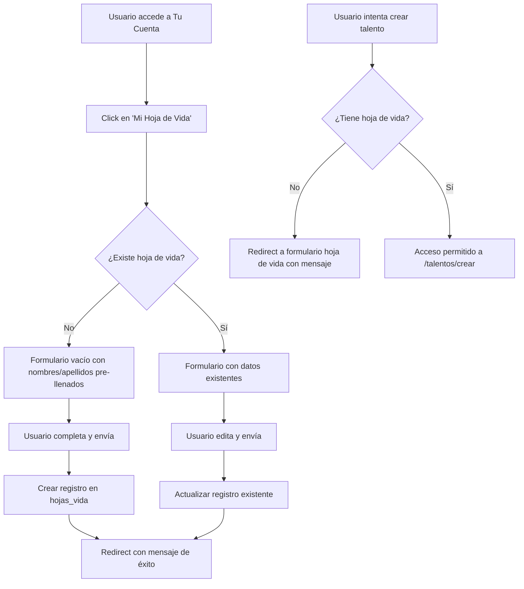

# Design Document: Talent Resume Profile (Hoja de Vida)

## Overview

Esta funcionalidad agrega un perfil profesional (hoja de vida) al sistema CambialóRD. Cada usuario autenticado puede crear y editar una única hoja de vida desde la página "Tu Cuenta". La hoja de vida es requisito obligatorio antes de publicar un talento (categoría 29). Por privacidad, no se almacenan ni solicitan teléfono ni correo electrónico. Los campos `nombres` y `apellidos` se pre-llenan automáticamente desde la tabla `users`.

### Flujo Principal



## Architecture

La solución sigue el patrón Controller → Model ya establecido en el proyecto. No requiere un Service layer dado que la lógica es CRUD simple con una validación de unicidad.

### Componentes

1. **Nueva migración** — Tabla `hojas_vida`
2. **Nuevo modelo `HojaVida`** — Eloquent model con relación `belongsTo(User)`
3. **Nuevo `HojaVidaController`** — Métodos `create`, `store`, `edit`, `update`
4. **Nueva vista `hoja-vida/form.blade.php`** — Formulario único para crear y editar
5. **Modificación de `tu_cuenta.blade.php`** — Agregar tarjeta "Mi Hoja de Vida" al grid
6. **Modificación de `User` model** — Agregar relación `hasOne(HojaVida)`
7. **Modificación de ruta `/talentos/crear`** — Verificar existencia de hoja de vida antes de permitir acceso
8. **Nuevas rutas** — `GET /mi-hoja-vida` y `POST /mi-hoja-vida`
9. **Script SQL `check.php`** — Para deploy en MochaHost sin SSH

### Decisiones de Diseño

- **Formulario único (create/edit)**: Se usa una sola vista `form.blade.php` que detecta si existe un registro. Esto simplifica el mantenimiento y es consistente con la naturaleza "una sola hoja de vida por usuario".
- **Rutas `GET /mi-hoja-vida` + `POST /mi-hoja-vida`**: Dos rutas simples. El GET muestra el formulario (vacío o con datos). El POST crea o actualiza según exista registro. Esto evita rutas separadas para create/store/edit/update.
- **Verificación en ruta de talentos**: Se agrega un check inline en la closure de la ruta `/talentos/crear` existente (no middleware), ya que es el único punto que necesita esta validación.
- **Sin Service layer**: La lógica es `updateOrCreate` con validación estándar de Laravel. No justifica una clase Service adicional.
- **Astro CSS**: Se usan las clases CSS existentes del proyecto (Tailwind utility classes compiladas estáticamente), consistente con las demás vistas.

## Components and Interfaces

### HojaVidaController

```php
class HojaVidaController extends Controller
{
    // GET /mi-hoja-vida — Muestra formulario (crear o editar)
    public function form(): View

    // POST /mi-hoja-vida — Crea o actualiza la hoja de vida
    public function save(Request $request): RedirectResponse
}
```

**`form()`**: Carga `HojaVida::where('id_user', auth()->id())->first()`. Si no existe, pre-llena `nombres` y `apellidos` desde `auth()->user()`. Retorna vista `hoja-vida.form`.

**`save()`**: Valida campos requeridos. Usa `HojaVida::updateOrCreate(['id_user' => auth()->id()], $validated)`. Redirect con mensaje de éxito.

### Modificación de ruta `/talentos/crear`

```php
// En routes/web.php, la closure existente de /talentos/crear:
// Agregar al inicio:
$hojaVida = \App\Models\HojaVida::where('id_user', auth()->id())->exists();
if (!$hojaVida) {
    return redirect()->route('hoja-vida.form')
        ->with('warning', 'Debes completar tu hoja de vida antes de publicar un talento');
}
```

### Modificación de User model

```php
// En app/Models/User.php, agregar relación:
public function hojaVida()
{
    return $this->hasOne(HojaVida::class, 'id_user', 'id');
}
```

### Rutas Nuevas

```php
// En routes/web.php, dentro del grupo auth:
Route::get('/mi-hoja-vida', [HojaVidaController::class, 'form'])->name('hoja-vida.form');
Route::post('/mi-hoja-vida', [HojaVidaController::class, 'save'])->name('hoja-vida.save');
```

## Data Models

### Nueva Tabla: `hojas_vida`

```sql
CREATE TABLE hojas_vida (
    id                  BIGINT UNSIGNED AUTO_INCREMENT PRIMARY KEY,
    id_user             BIGINT UNSIGNED NOT NULL,
    nombres             VARCHAR(100) NOT NULL,
    apellidos           VARCHAR(100) NOT NULL,
    titulo_profesional  VARCHAR(150) NOT NULL,
    descripcion_bio     TEXT NOT NULL,
    habilidades         TEXT NOT NULL,
    experiencia         TEXT NOT NULL,
    ubicacion           VARCHAR(200) NOT NULL,
    created_at          TIMESTAMP NULL,
    updated_at          TIMESTAMP NULL,

    UNIQUE KEY uk_id_user (id_user),
    FOREIGN KEY (id_user) REFERENCES users(id) ON DELETE CASCADE
) ENGINE=InnoDB DEFAULT CHARSET=utf8mb4 COLLATE=utf8mb4_unicode_ci;
```

### Modelo: HojaVida

```php
class HojaVida extends Model
{
    protected $table = 'hojas_vida';

    protected $fillable = [
        'id_user',
        'nombres',
        'apellidos',
        'titulo_profesional',
        'descripcion_bio',
        'habilidades',
        'experiencia',
        'ubicacion',
    ];

    public function user()
    {
        return $this->belongsTo(User::class, 'id_user', 'id');
    }
}
```

Campos excluidos intencionalmente de `$fillable`: `telefono`, `email` — no existen en la tabla ni en el formulario. Cualquier intento de inyectar estos campos vía mass assignment será ignorado por Laravel.

### Migración

```php
// database/migrations/YYYY_MM_DD_000001_create_hojas_vida_table.php
return new class extends Migration {
    public function up(): void
    {
        Schema::create('hojas_vida', function (Blueprint $table) {
            $table->id();
            $table->unsignedBigInteger('id_user');
            $table->string('nombres', 100);
            $table->string('apellidos', 100);
            $table->string('titulo_profesional', 150);
            $table->text('descripcion_bio');
            $table->text('habilidades');
            $table->text('experiencia');
            $table->string('ubicacion', 200);
            $table->timestamps();

            $table->unique('id_user', 'uk_id_user');
            $table->foreign('id_user')->references('id')->on('users')->onDelete('cascade');
        });
    }

    public function down(): void
    {
        Schema::dropIfExists('hojas_vida');
    }
};
```


## Correctness Properties

*A property is a characteristic or behavior that should hold true across all valid executions of a system — essentially, a formal statement about what the system should do. Properties serve as the bridge between human-readable specifications and machine-verifiable correctness guarantees.*

### Property 1: Pre-fill user data on first access

*For any* authenticated user without an existing hoja de vida, accessing the form should return view data where `nombres` equals the user's `nombres` and `apellidos` equals the user's `apellidos` from the `users` table.

**Validates: Requirements 1.1, 1.2**

### Property 2: Creation stores all fields and links to user

*For any* authenticated user and any valid set of form fields (nombres, apellidos, titulo_profesional, descripcion_bio, habilidades, experiencia, ubicacion), submitting the form should create exactly one `hojas_vida` record where `id_user` matches the authenticated user's id and all field values match the submitted data.

**Validates: Requirements 2.1, 2.2**

### Property 3: One record per user (updateOrCreate uniqueness)

*For any* authenticated user who already has a hoja de vida, submitting the form with new valid data should update the existing record rather than creating a second one. After submission, there should be exactly one `hojas_vida` record for that `id_user`, and its fields should match the newly submitted data.

**Validates: Requirements 2.3, 3.2**

### Property 4: Store-then-load round trip

*For any* hoja de vida that has been saved, accessing the form should return view data where every field (nombres, apellidos, titulo_profesional, descripcion_bio, habilidades, experiencia, ubicacion) matches the stored record exactly.

**Validates: Requirements 3.1**

### Property 5: Validation rejects incomplete submissions

*For any* non-empty subset of required fields that is omitted from the form submission, the system should reject the request and return validation errors for each missing field, without creating or modifying any `hojas_vida` record.

**Validates: Requirements 2.4**

### Property 6: Talent creation gate

*For any* authenticated user, accessing the talent creation route (`/talentos/crear`) should redirect to the hoja de vida form if and only if the user does not have a `hojas_vida` record. If the user has a record, access should proceed without redirection.

**Validates: Requirements 5.1, 5.3**

### Property 7: Mass assignment ignores disallowed fields

*For any* form submission that includes `telefono` or `email` fields alongside valid fields, the system should create/update the hoja de vida with only the allowed fields. The stored record should not contain telefono or email values, and the allowed fields should be stored correctly.

**Validates: Requirements 6.3**

## Error Handling

### Errores de Validación

| Escenario | Respuesta |
|---|---|
| Usuario envía formulario con campos requeridos vacíos | Redirect back con errores de validación por campo |
| Usuario envía datos que exceden longitud máxima | Redirect back con error de validación |
| Request intenta inyectar campos `telefono` o `email` | Campos ignorados silenciosamente (mass assignment protection) |

### Errores de Sistema

- **Fallo al crear/actualizar registro**: Se captura la excepción, se loguea con `Log::error()`, y se retorna redirect con mensaje genérico "Error al guardar la hoja de vida".
- **Violación de constraint UNIQUE en `id_user`**: Manejado por `updateOrCreate` — no debería ocurrir en flujo normal. Si ocurre por race condition, Laravel lanza `QueryException` que se captura en el catch general.

## Testing Strategy

### Unit Tests

Los unit tests cubren ejemplos específicos y edge cases:

- Crear hoja de vida con datos válidos → registro creado correctamente
- Acceder al formulario sin hoja de vida → nombres/apellidos pre-llenados desde user
- Acceder al formulario con hoja de vida existente → datos cargados del registro
- Enviar formulario con campos vacíos → errores de validación
- Enviar formulario con campos `telefono`/`email` → campos ignorados
- Acceder a `/talentos/crear` sin hoja de vida → redirect a formulario con mensaje
- Acceder a `/talentos/crear` con hoja de vida → acceso permitido
- Vista `tu_cuenta` sin hoja de vida → card muestra "Completa tu perfil profesional"
- Vista `tu_cuenta` con hoja de vida → card muestra "Edita tu perfil profesional"
- Formulario no contiene inputs de teléfono ni email (verificar HTML renderizado)

### Property-Based Tests

Se usará **PHPUnit** con un helper generador de datos aleatorios (consistente con el approach del spec `service-purchase-approval`). Cada test ejecuta mínimo 100 iteraciones.

Cada test de propiedad debe:
- Ejecutar mínimo 100 iteraciones con datos generados aleatoriamente
- Referenciar la propiedad del diseño con un comentario tag
- Formato del tag: **Feature: talent-resume-profile, Property {N}: {título}**

**Propiedades a implementar como tests:**

1. **Property 1**: Generar usuarios aleatorios sin hoja de vida → verificar pre-fill de nombres/apellidos
2. **Property 2**: Generar datos de formulario aleatorios válidos → verificar creación con todos los campos
3. **Property 3**: Generar usuarios con hoja de vida existente + datos nuevos → verificar que sigue habiendo exactamente un registro actualizado
4. **Property 4**: Generar hojas de vida aleatorias, guardarlas, luego cargar el formulario → verificar que los datos coinciden (round trip)
5. **Property 5**: Generar subconjuntos aleatorios de campos requeridos omitidos → verificar rechazo
6. **Property 6**: Generar usuarios aleatorios con y sin hoja de vida → verificar redirect condicional en ruta de talentos
7. **Property 7**: Generar submissions con campos extra (telefono, email) → verificar que no se almacenan
